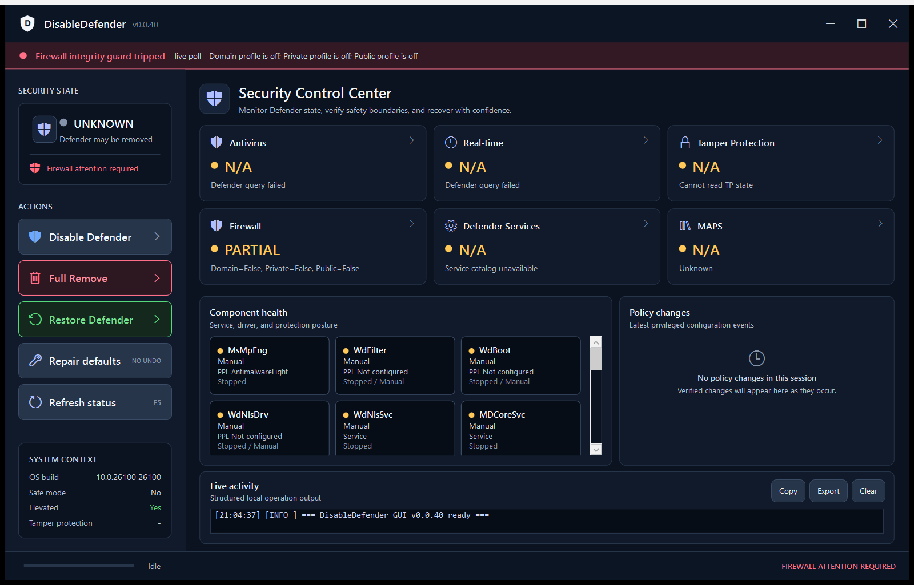

# DisableDefender

[](https://github.com/SysAdminDoc/DisableDefender/releases)
[](LICENSE)
[](https://www.microsoft.com/windows)
[](https://learn.microsoft.com/powershell)




**The ultimate Microsoft Defender Antivirus disabler / remover for Windows 10 and 11.**

DisableDefender fully disables (and optionally removes) Microsoft Defender Antivirus while **explicitly preserving the Windows Firewall**. Firewall services (`mpssvc`, `BFE`, `SharedAccess`) and policy keys are on a refuse-list and verified intact before and after every operation.

PowerShell-native module with **both a CLI launcher and a premium WPF GUI**. No external dependencies. Reversible. Built from a synthesis of the best community techniques (policy keys, `Set-MpPreference`, registry ACL takeover, SYSTEM-via-task fallback, DISM package removal, SecHealthUI deprovision, scheduled task nuke, SafeBoot trap).

---

## GUI

A safety-first WPF control center with custom chrome, explicit protection-state hierarchy, component evidence, policy-change history, embedded activity output, and asynchronous execution.

Run via:
```powershell
.\DisableDefender.GUI.ps1
```
or double-click `DisableDefender.GUI.bat`.

Dashboard tiles show: Antivirus engine, Real-time protection, Tamper Protection (with warning banner + direct link to Windows Security), Firewall, Defender service count, MAPS telemetry, and a per-component lockdown grid for Defender services/drivers with PPL or LaunchProtected state for MsMpEng, WdFilter, WdBoot, and WdNisDrv. A live policy edit stream tags direct writes, ACL overrides, and SYSTEM-task fallback methods as they happen. The always-on firewall integrity banner polls mpssvc, BFE, and firewall profiles, then flashes red if any guard trips. Disable/Remove confirmations expose a default-off `-Force` override checkbox instead of bypassing safety gates automatically. Overall indicator summarizes to PROTECTED / DISABLED / BLOCKED. Live log pane streams every operation with level colors (INFO / OK / WARN / ERROR / DEBUG). Copy, Export, Clear buttons. Toast notifications on completion.
Disable confirmation includes a current-vs-target drift preview before execution.

---

## Features

- **Three modes**: `Disable` (reversible), `Remove` (aggressive), `Restore` (undo)
- **Firewall preservation** with critical (`mpssvc`, `BFE`) vs touch-refuse separation; pre/post integrity guard aborts if profile flips off
- **Registry ACL takeover** via `SeTakeOwnershipPrivilege` + `Microsoft.Win32.Registry` — each allowlisted key gets a per-run, atomically replaced write-ahead journal with its original owner flushed before ownership changes and its original DACL flushed before permission changes
- **SYSTEM-via-task fallback** for keys that even Admin+ACL-override can't touch, with task result/output logging
- **Multi-strategy `Set-ServiceStart`**: direct write → ACL takeover → SYSTEM task, with target-state verification after every strategy
- **Full policy coverage** (privacy.sexy-enriched): `DisableAntiSpyware`, real-time, behavior, IOAV, IPS, IPC, spynet, MAPS, NIS, IPS-throttle, MpEngine PUA + file-hash, signatures, scan, SmartScreen, MRT, passive-mode for MDE, UX suppression, legacy `Microsoft Antimalware`
- **Runtime prefs**: cataloged `Set-MpPreference` sweep with restore defaults, health expectations, and global path/extension exclusions
- **Scheduled tasks**: all four Defender tasks + ExploitGuard refresh disabled
- **Service takedown**: 16 Defender services by default, including `MDCoreSvc`, `MDDlpSvc`, `MsSecFlt`, `MsSecCore`, `SgrmAgent`/`Broker`, `webthreatdefsvc`; MDE `Sense` requires explicit `-IncludeMDE`
- **Appx removal**: SecHealthUI deprovision with `NonRemovableAppPolicy` override
- **SafeBoot trap** (Remove mode): nukes `SafeBoot\{Minimal,Network}\WinDefend` so the service can't load even in Safe Mode
- **Restore point** before any destructive op (opt-out with `-NoRestorePoint`)
- **Runtime directory preflight**: `%ProgramData%\DisableDefender` refuses junctions/symlinks and repairs weak ACLs before writing logs, manifests, phase state, tripwires, ACL backups, or SYSTEM task output
- **Privileged restore-input leases**: manifests, replay state, and ACL backups are size-bounded and read through one owner/DACL/reparse/file-identity-validated handle that denies concurrent writes and replacement
- **Transactional exact restore**: Disable/Remove record versioned, target-allowlisted JSONL undo entries; Restore rejects mixed RunIds or non-contiguous sequences before mutation, replays the exact leased bytes in reverse order, restores only ACL journals matching the selected manifest RunIds, verifies the recorded baseline, and only then archives it. Interrupted replay and archive finalization resume from durable state.
- **Explicit no-manifest repair**: `-RepairWithoutManifest` runs the separate fixed-default repair preset and is refused while a selected undo manifest exists
- **Atomic phase boundaries**: each mode records phase status to `phase-state.json`; failures log partial state plus resume/rollback recovery choices
- **Shared fail-closed Firewall guard**: every mutation phase and the GUI use the same read-only check; missing, disabled, or stopped `mpssvc` / `BFE`, unavailable required profiles, or any profile switched off abort the operation
- **Known-bad Remove gate**: domain-joined machines are refused unless `-Force` is passed and emit JSONL tripwires
- **Unfilterable safety gates**: `-Only` / `-Skip` apply only to mutation phases; prerequisites, managed/domain and Safe Mode gates, restore-point handling, and Firewall pre/postflight always run
- **PSRemoting guard**: Disable/Remove/Restore refuse PSSession execution unless `-AllowRemoting` is explicit
- **Restore point throttle awareness**: Windows restore-point interval refusals are logged with the configured cadence instead of a generic warning
- **Surgical repair reruns**: `-Only` and `-Skip` phase filters for the explicit no-manifest repair preset; transactional recorded-baseline restore cannot be filtered
- **Health mode + Restore verification**: compares current state to Disable/Remove/fixed-default Restore targets and reports drift for services, policy keys, tasks, Appx, SafeBoot, and MpPreference; recorded-baseline Restore verifies its manifest expectations directly
- **Feature-update drift detection**: Disable/Remove record a Defender surface baseline; Health flags changed Windows builds plus unknown Defender-like services, tasks, and packages and prints a reapply plan that preserves firewall and MDE Sense by default
- **Local release builder**: creates an unsigned clean zip, SHA256 file, and release metadata JSON inside an identity-tracked staging directory
- **Safe Mode transaction**: `Invoke-SafeModeRemove` persists and verifies the worker and independent BCD watchdog before changing boot state, records child/task/effect evidence across boots, and finalizes or rolls back deterministically
- **Support bundle export**: `Export-DefenderSupportBundle` collects logs, phase-state, tripwires, component status, health summary, Windows build info, and optional redacted Defender event-log excerpts into a diagnostic zip without secrets
- **Offline remove bundle** (`PrepareOffline`): generates a self-contained `Invoke-OfflineDefenderRemove.ps1` that targets an offline Windows volume from WinRE or a secondary OS, bypassing live Tamper Protection by editing dormant registry hives directly; refuses to run against the live system root
- **Module layout**: `DisableDefender.psd1` / `DisableDefender.psm1` with public commands and private helpers for function-level tests
- **GUI auto-elevate, silent CLI mode, transcript logging, Safe Mode aware**

## Requirements

- Windows 10 (1809+) or Windows 11 (any build, including 24H2/25H2)
- PowerShell 5.1+ (PowerShell 7 works too)
- Administrator rights (GUI auto-elevates; CLI must run from an elevated PowerShell session)
- **Tamper Protection OFF** — you must toggle this manually first:
  *Settings > Windows Security > Virus & threat protection > Manage settings > Tamper Protection*
  There is no scripted bypass for Tamper Protection on 24H2+. DisableDefender detects the state and aborts if still on.

## Usage

### GUI (recommended)
```powershell
.\DisableDefender.GUI.ps1
```
Or double-click `DisableDefender.GUI.bat`. Auto-elevates to Administrator.

### Interactive CLI
```powershell
powershell -ExecutionPolicy Bypass -File .\DisableDefender.ps1
```
A menu appears with Disable / Remove / Restore / Status / Health / Prepare Offline.

### CLI
```powershell
# Reversible disable
.\DisableDefender.ps1 -Mode Disable

# Full removal (Safe Mode recommended)
.\DisableDefender.ps1 -Mode Remove

# Restore the exact recorded baseline (requires an undo manifest)
.\DisableDefender.ps1 -Mode Restore

# Undo every archived run chain after repeated Disable/Remove runs
.\DisableDefender.ps1 -Mode Restore -ManifestSelection All

# Explicit fixed-default repair when no undo manifest exists
.\DisableDefender.ps1 -Mode Restore -RepairWithoutManifest

# Just show state
.\DisableDefender.ps1 -Mode Status

# Health check against the Disable target
.\DisableDefender.ps1 -Mode Health

# After a Windows feature update, review drift and the reapply plan
.\DisableDefender.ps1 -Mode Health -HealthTarget Disable

# Silent automation
.\DisableDefender.ps1 -Mode Disable -Silent -NoReboot

# JSON status for automation
.\DisableDefender.ps1 -Mode Status -Json
.\DisableDefender.ps1 -Mode Health -HealthTarget Remove -Json

# Surgical reruns
.\DisableDefender.ps1 -Mode Disable -Only Policies,MpPreference
.\DisableDefender.ps1 -Mode Remove -Skip DISM,Appx -Force
```

### Module
```powershell
Import-Module .\DisableDefender.psd1
Get-DefenderStatus
Get-DefenderFirewallStatus
Get-DefenderHealth -Target Disable
Invoke-DisableDefender -Force -NoRestorePoint
Invoke-RestoreDefender
Invoke-RestoreDefender -ManifestSelection All
Invoke-RestoreDefender -RepairWithoutManifest

# Export diagnostic bundle
Export-DefenderSupportBundle -OutputDirectory C:\Support
Export-DefenderSupportBundle -IncludeEventLog

# Generate single-file HTML report
Export-DefenderHtmlReport
Export-DefenderHtmlReport -OutputPath C:\Reports\defender.html -HealthTarget Remove

# Automated Safe Mode Remove (reboot -> Remove -> reboot back)
Invoke-SafeModeRemove
Invoke-SafeModeRemove -IncludeMDE -DelaySeconds 30
# Preserve an intentional managed/domain or normal-boot override
Invoke-SafeModeRemove -Force

# Inspect the durable stage, live task/BCD evidence, and recovery recommendation
Get-DefenderSafeModeStatus
Get-DefenderSafeModeStatus -Json

# Explicitly resume a verified pre-boot stage or roll an interrupted run back
Invoke-SafeModeRemove -RecoveryAction Resume
Invoke-SafeModeRemove -RecoveryAction Rollback

# Save a state snapshot, then compare later
Save-DefenderSnapshot -OutputPath C:\Snapshots\before.json
# ... weeks pass, a feature update lands ...
Compare-DefenderSnapshots -BaselinePath C:\Snapshots\before.json
Compare-DefenderSnapshots -BaselinePath before.json -CurrentPath after.json -Json
```

### Offline Remove (WinRE / secondary OS)

When Tamper Protection cannot be toggled off (e.g. managed devices, locked UI), generate a self-contained script that edits registry hives from an offline volume:

```powershell
# Generate the bundle
.\DisableDefender.ps1 -Mode PrepareOffline

# Or via the module
Import-Module .\DisableDefender.psd1
New-OfflineRemoveBundle -OutputDirectory C:\OfflineBundle
```

Copy the generated `Invoke-OfflineDefenderRemove.ps1` to a USB drive, boot into WinRE or a secondary Windows install, and run:

```powershell
.\Invoke-OfflineDefenderRemove.ps1 -TargetVolume D:\
```

The script loads the offline volume's SOFTWARE and SYSTEM registry hives, applies all Defender policy keys, disables services, removes SafeBoot entries, and disables WMI Autologger telemetry. It refuses to run against the live system drive. After booting the target into Safe Mode, run `-Mode Health` and `-Mode Remove -Only MpPreference,Tasks,Appx,DISM` to complete the remaining live-only steps. Pass `-Force` to `New-OfflineRemoveBundle` only when the generated completion command must preserve an intentional managed/domain or normal-boot override.

### Parameters
| Flag | Description |
|---|---|
| `-Mode` | `Disable` / `Remove` / `Restore` / `Status` / `Health` / `PrepareOffline` |
| `-Silent` | No console output, no prompts. Requires `-Mode`. |
| `-NoRestorePoint` | Skip System Restore checkpoint. |
| `-NoReboot` | Don't auto-reboot at end. |
| `-Force` | Bypass Tamper Protection / managed-device / Safe Mode abort gates. GUI users must explicitly select the override checkbox. |
| `-AllowRemoting` | Allow Disable/Remove/Restore inside PSRemoting or PSSession contexts. |
| `-IncludeMDE` | Also target the MDE `Sense` service. Disabled by default to preserve enterprise EDR visibility. |
| `-Json` | Emit JSON output. Applies to `Status`, `Health`, and error envelopes. |
| `-Only` | Run only matching action phases. Common keys: `Policies`, `MpPreference`, `Tasks`, `Services`, `Appx`, `DISM`, `SafeBoot`, `ContextMenu`. Mandatory safety and Firewall phases always run. |
| `-Skip` | Skip matching action phases while running the rest of the selected mode. Mandatory safety and Firewall phases cannot be skipped. |
| `-ManifestSelection` | Restore manifest selection for `Restore`: `Newest` (default), `All`, or `Active`. Use `All` after repeated Disable/Remove runs when older undo chains must also be replayed. |
| `-RepairWithoutManifest` | Explicitly run the fixed-default Restore repair preset when no selected undo manifest exists. This is not an exact baseline restore. |
| `-HealthTarget` | Expected target for `-Mode Health`: `Disable`, `Remove`, or `Restore`. |
| `-LogPath` | Override log path (default `%ProgramData%\DisableDefender\DisableDefender.log`). |

## Exit codes

| Code | Meaning | Repair |
|------|---------|--------|
| 0 | Success | |
| 1 | Unknown / unclassified error | Check logs |
| 2 | Tamper Protection is ON | Toggle off in Windows Security UI |
| 3 | Safe Mode required for Remove | Boot to Safe Mode or use `-Force` |
| 4 | Firewall integrity check failed | `netsh advfirewall set allprofiles state on` |
| 5 | Managed device (Intune/MDM/MDE) | Use `-Force` (may trigger compliance violations) |
| 6 | Restore verification failed | Run `-Mode Health -HealthTarget Restore` |
| 7 | Phase filters selected nothing | Check `-Only` / `-Skip` values |
| 8 | PSRemoting session blocked | Use `-AllowRemoting` |
| 9 | Domain-joined machine (Remove) | Use `-Force` (may trigger SIEM alerts) |

With `-Json`, fatal errors emit a stable object:
```json
{
  "Ok": false,
  "Mode": "Disable",
  "ExitCode": 2,
  "ErrorCode": "TAMPER_PROTECTION",
  "Message": "Tamper Protection blocks changes.",
  "FailedPhase": "Prerequisites",
  "PhaseStatePath": "C:\\ProgramData\\DisableDefender\\phase-state.json",
  "RepairCommands": ["Toggle Tamper Protection off in Windows Security UI, then retry."],
  "Timestamp": "2026-06-30T22:00:00.0000000-04:00"
}
```

## Local release readiness check

Build first, then run the strict local gate:
```powershell
.\tools\New-DisableDefenderRelease.ps1
.\tools\Test-ReleaseReadiness.ps1
```

`tools\ReleaseGate.psd1` pins Pester 5.8.0, PSScriptAnalyzer 1.25.0, the minimum passed-test count, and the command-coverage ratchet. The gate fails when either dependency is missing, any source/module/CLI/GUI/README/changelog/archive version differs, artifact-schema fixtures drift, the exact ZIP/hash/metadata set is missing or stale, archive bytes differ from source, or coverage falls below the ratchet. It then builds from a fresh detached checkout and requires the clean build to reproduce the published ZIP SHA256 exactly.

`-SkipCoverage`, `-SkipAnalyzer`, and `-SkipCleanBuild` exist only for explicitly partial development checks; output labels those runs as not full release qualification.

## Local release build and Smart App Control

Build the distributable locally:
```powershell
.\tools\New-DisableDefenderRelease.ps1
```

The builder creates `dist\DisableDefender-vX.Y.Z.zip`, a `.sha256` hash manifest, and `DisableDefender-vX.Y.Z.release.json`. ZIP entry timestamps are normalized so identical committed source produces identical bytes across the working tree and detached checkout. Metadata records the source commit and whether release inputs differ from it. Releases are intentionally unsigned. Recursive cleanup is confined to a new identity-tracked stage under `dist`; repository roots, source directories, prefix-sharing siblings, existing temp directories, reparse points, and substituted paths are refused.

Smart App Control can block unknown, unsigned, or low-reputation apps. See Microsoft’s [Smart App Control FAQ](https://support.microsoft.com/windows/smart-app-control-faq-285ea03d-fa88-4d56-882e-6698afdb7003). If SAC blocks the unsigned zip or launcher, extract manually, review the scripts, unblock the downloaded files if appropriate, and run from an elevated PowerShell session.

## What each mode does

### Disable (reversible)
1. Checks Tamper Protection is off
2. Verifies firewall intact
3. Creates System Restore point
4. Writes Defender policy keys (anti-spyware, real-time, behavior, IPS, spynet, passive-mode, SmartScreen, MRT)
5. Applies `Set-MpPreference` sweep + global exclusions
6. Disables 5 scheduled tasks
7. Stops + disables Defender services (NOT firewall; MDE `Sense` only with `-IncludeMDE`)
8. Re-verifies firewall intact
9. Prompts reboot

### Remove (aggressive)
Everything Disable does, plus:
- Deprovisions the `Microsoft.SecHealthUI` Appx package (with `NonRemovableAppPolicy` override)
- DISM-removes `Windows-Defender` / `SecurityClient` platform packages
- **Best run from Safe Mode** for service registry key edits to stick

### Restore (undo)
- Prevalidates and replays the newest non-empty `%ProgramData%\DisableDefender\restore-manifest*.jsonl` in reverse order, with RunId, entry count, SHA256, and file-identity logging
- Rejects mixed RunIds, sequence gaps/duplicates, oversized or over-depth data, extra schema fields, non-allowlisted registry/service/task/preference/package targets, reparse points, weak runtime-file ACLs, and concurrent input replacement before privileged mutation
- Warns when older archived undo chains exist; use `-ManifestSelection All` to replay active and archived manifests newest-first
- Restores each recorded registry value/tree, `MpPreference`, task, service, SafeBoot, context-menu, DISM package, and Security Health package/marker set to its exact pre-run state
- Prevalidates every selected ACL journal, unwinds repeated runs newest-first, and restores owner-only crash checkpoints or full owner/DACL baselines; any failed replay retains the whole active set, while total success moves journals to retained `.restored.*` archives
- Preserves the selected manifests and a durable resume point after replay, verification, or archive interruption; archives manifests only after exact verification
- Refuses `-Only`/`-Skip`, so a recorded transaction cannot bypass part of its baseline
- With no manifest, stops before mutation unless `-RepairWithoutManifest` explicitly selects fixed-default repair; that repair supports `-Only`/`-Skip` and ends with fixed-target health guidance

## Firewall preservation (explicit guarantee)

The following are on a hard refuse-list and will never be modified:

**Critical** (must stay running — script aborts if they're disabled or profiles are off):
- Services: `mpssvc`, `BFE`
- Per-profile firewall state (Domain / Private / Public)

**Touch-refuse** (script never writes to these, even if they happen to be disabled by default like `SharedAccess`/ICS):
- Services: `mpssvc`, `BFE`, `SharedAccess`, `MpsDrv`, `mpsdrv`, `MsSecWfp`, `IKEEXT`, `PolicyAgent`, `Dnscache`, `Dhcp`, `Wlansvc`, `NetSetupSvc`
- Policy paths: `HKLM\SOFTWARE\Policies\Microsoft\WindowsFirewall`, `HKLM\SYSTEM\...\mpssvc`, `HKLM\SYSTEM\...\BFE`, `HKLM\SYSTEM\...\SharedAccess\Parameters\FirewallPolicy`, `...\MpsDrv`, `...\MsSecWfp`

v0.0.2 fixed a false-positive where `SharedAccess` (ICS, off by default) tripped the guard. v0.0.3 renamed the project from DefenderPurge → DisableDefender.

## Warnings

- **Your PC will have no antivirus after running this.** Install an alternative AV if that matters to you.
- Tamper Protection must be off first. No workaround exists on Windows 11 24H2+.
- `Remove` mode partially bricks the Windows Security UI. Exact Restore attempts to reinstate the recorded package set but can fail safely if its package payload is no longer available; use `-RepairWithoutManifest` only when no undo manifest remains.
- Windows Update may periodically re-install parts of Defender; re-run `-Mode Disable` after major feature updates.
- Use at your own risk on production systems. Authored for lab / workstation / dedicated-purpose machines (medical imaging, PACS/DICOM, VM hosts).

## Troubleshooting

| Symptom | Fix |
|---|---|
| "Tamper Protection blocks changes" | Toggle off in Windows Security UI, rerun |
| Services come back after reboot | Boot to Safe Mode, run `-Mode Remove` |
| Get-MpComputerStatus errors in Status | Defender platform is partly removed — expected |
| Exact Restore reports a missing Security Health package payload | Preserve the manifest, run `sfc /scannow` then `DISM /Online /Cleanup-Image /RestoreHealth`, and retry the same Restore selection |
| No restore manifest exists | Run `-Mode Restore -RepairWithoutManifest` to request the separate fixed-default repair preset |
| Firewall got disabled | Run `-Mode Restore -RepairWithoutManifest`, or `netsh advfirewall set allprofiles state on` |

## Log locations
- `%ProgramData%\DisableDefender\DisableDefender.log` (human-readable text)
- `%ProgramData%\DisableDefender\DisableDefender.jsonl` (structured JSONL for SIEM/automation)
- `%ProgramData%\DisableDefender\transcript.log`
- `%ProgramData%\DisableDefender\restore-manifest.jsonl`
- `%ProgramData%\DisableDefender\restore-manifest.*.jsonl`
- `%ProgramData%\DisableDefender\acl-backup.<RunId>.json` (active write-ahead ACL journal)
- `%ProgramData%\DisableDefender\acl-backup.<RunId>.restored.<Timestamp>.json` (verified retained ACL archive)
- `%ProgramData%\DisableDefender\surface-baseline.json`
- `%ProgramData%\DisableDefender\phase-state.json`
- `%ProgramData%\DisableDefender\safe-mode-transaction.json`
- `%ProgramData%\DisableDefender\tripwire.jsonl`

## Persisted artifact compatibility

`Private\ArtifactSchema.ps1` is the single compatibility registry. As of 2026-07-29, restore-manifest entries, replay and phase state, ACL journals, Safe Mode state, surface baselines, snapshots, operation results, JSONL logs/tripwires, support-bundle documents, error envelopes, and release metadata each have an independent schema at version 1.

- Mutation-critical readers reject missing, retired, or unknown future versions before use and include upgrade/migration guidance.
- Current JSON files are flushed and published by same-directory atomic replacement; a failed replacement leaves the prior artifact intact.
- Legacy `acl-backup.clixml` journals remain constrained and read-only until verified replay archives them. Existing unversioned JSONL logs, tripwires, support documents, error envelopes, and release metadata are recognized as legacy inputs without rewriting the originals.
- `Tests\Fixtures\artifact-schemas.json` is the golden current/legacy/future compatibility matrix.

## License

MIT. See [LICENSE](LICENSE).

## Credits / Prior Art

Techniques synthesized from:
- [undergroundwires/privacy.sexy](https://github.com/undergroundwires/privacy.sexy) — comprehensive policy key catalog (NIS, MpEngine, IPC, UX, SpyNet overrides, legacy Antimalware), MpPreference-first strategy, `grantPermissions` ACL takeover approach, SafeBoot\WinDefend trick, extended service list (`MsSecFlt`, `MsSecCore`, `SgrmAgent/Broker`, `MDDlpSvc`, `webthreatdefsvc`)
- [ionuttbara/windows-defender-remover](https://github.com/ionuttbara/windows-defender-remover) — DISM `NonRemovableAppPolicy` pattern, SecHealthUI deprovision
- [pgkt04/defender-control](https://github.com/pgkt04/defender-control) — registry flag research
- [conspiracyrip/DefenderControlV2](https://github.com/conspiracyrip/DefenderControlV2) — anti-tamper service kill surface
- Microsoft `Set-MpPreference` and `admx.help` documentation
